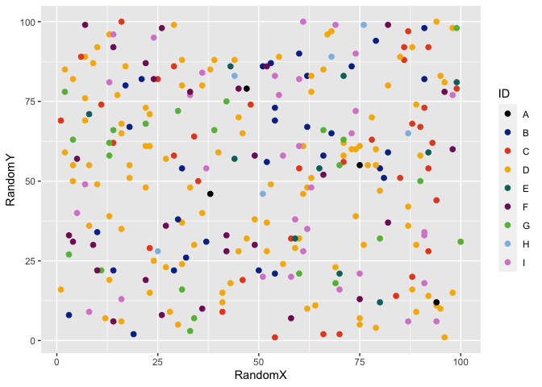
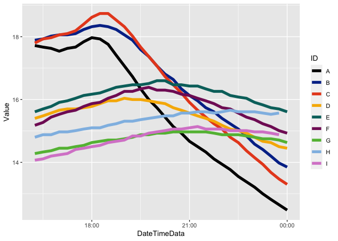
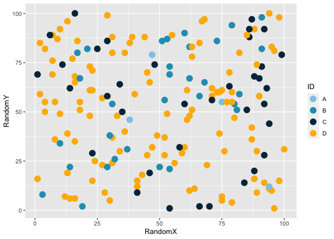

<!-- README.md is generated from README.Rmd. Please edit that file -->

# poispalette

<!-- badges: start -->

[](https://www.tidyverse.org/lifecycle/#experimental)
[](https://travis-ci.com/poissonconsulting/poispalette)
[](https://ci.appveyor.com/project/poissonconsulting/poispalette)
[](https://codecov.io/gh/poissonconsulting/poispalette?branch=master)
[](https://opensource.org/licenses/MIT)
<!-- badges: end -->

## Introduction

`poispalette` is an R package that facilitates the use of Poisson
Consulting colour palettes in data plots and maps.

## Installation

To install the latest development version from
[GitHub](https://github.com/poissonconsulting/poispalette)

``` r
# install.packages("remotes")
remotes::install_github("poissonconsulting/poispalette")
```

To install the latest developmental release from the Poisson drat
[repository](https://github.com/poissonconsulting/drat)

``` r
# install.packages("drat")
drat::addRepo("poissonconsulting")
install.packages("poispalette")
```

## Demonstration

``` r
library(ggplot2)
library(poispalette)

ggplot(poispalette::points, aes(x = RandomX, y = RandomY)) +
  geom_point(aes(colour = ID), size = 2) +
  poispalette::scale_colour_disc_pois()
```



``` r

ggplot(poispalette::points, aes(x = X)) +
  geom_histogram(aes(fill = ID), binwidth = 30) +
  poispalette::scale_fill_disc_pois()
```



``` r

ggplot(poispalette::lines, aes(x = DateTimeData, y = Value)) +
  geom_line(aes(colour = ID), size = 2) +
  poispalette::scale_colour_disc_pois(palette = "legacy")
```


``` r

ggplot(poispalette::points, aes(x = X, y = Y)) +
  geom_point(aes(colour = RandomX), size = 2) +
  poispalette::scale_colour_grad_pois(palette = "cool")
```



## Contribution

Please report any
[issues](https://github.com/poissonconsulting/poispalette/issues).

[Pull requests](https://github.com/poissonconsulting/poispalette/pulls)
are always welcome.

Please note that this project is released with a [Contributor Code of
Conduct](https://github.com/poissonconsulting/poispalette/blob/master/CODE_OF_CONDUCT.md).
By contributing, you agree to abide by its terms.
